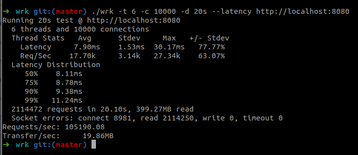
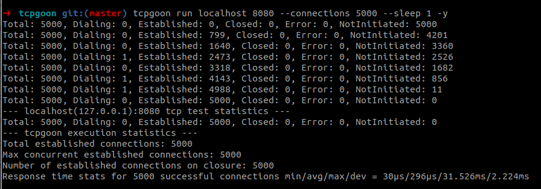
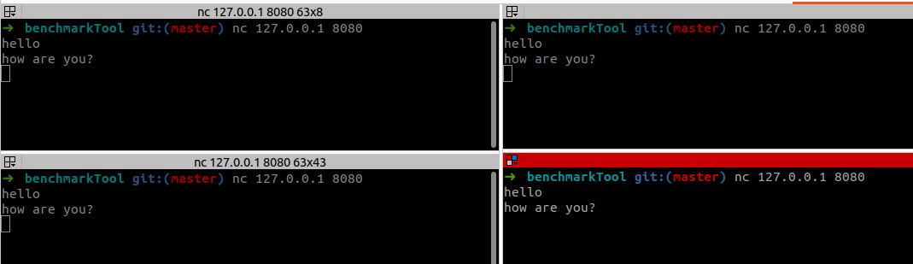

# Env

- GCC 11.3
- Ubuntu 22.04 LTS
- MSI Modern 15 (i5 1155G7 - 16GB RAM)

# Prerequisites

Default maximum number of descriptor files can be opened in Ubuntu OS is 1024, we must increase this number in order to handle 5k.
To increase the limitation, run `ulimit -n 10000`

# How to test?

### With simple spec test file (tcp-server_spec.cpp)

- Compile the project
- Execute test `./build/simple-tcp-server-tests --gtest_filter=TCPServerTest.SimpleServer`
- Observe the 5k connections are made

> Unknown issue happens when I run both tests of TCPServerTest at once that causes the test client waits forever.
> It is not worth taking time to solve it as they can be executed separately. For now, I decide to keep it as is.

### Benchmarked with simple node client

- Install npm test client by `cd test-client && npm install`
- Start tcp server `./build/simple-tcp-server`
- Start test client `cd test-client && npm test`
- Observe the output

### Benchmarked with tcpgoon

- Start tcp server `./build/simple-tcp-server`
- Execute tcpgoon benchmark session by `tcpgoon run localhost 8080 --connections 5000 --sleep 1 -y`
- Observe the output

### Test simple chat server with Netcat

- Start chat server `./build/simple-chat-server`
- Start a few Netcat sessions by `nc 127.0.0.1 8080`
- Type a message in one Netcat session window
- Observe the broadcasted messages in other Netcat window

